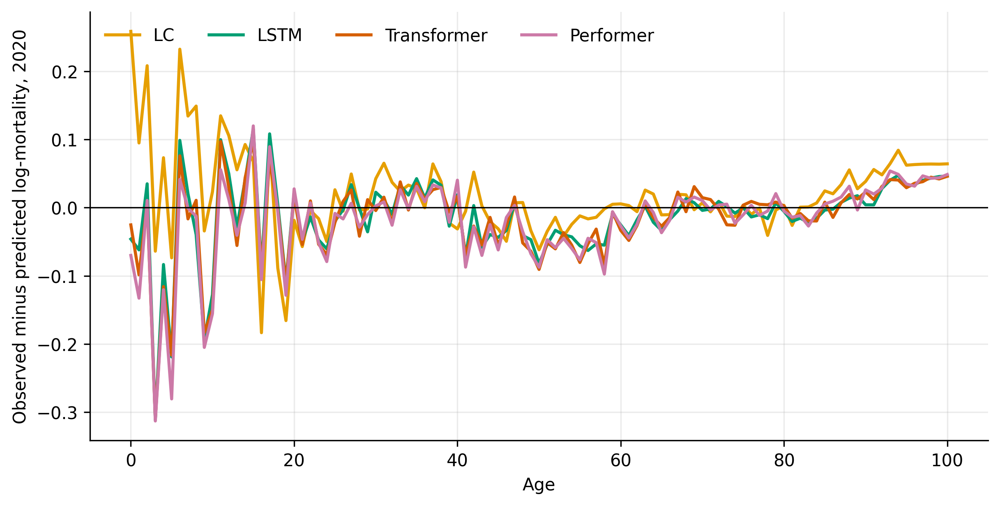
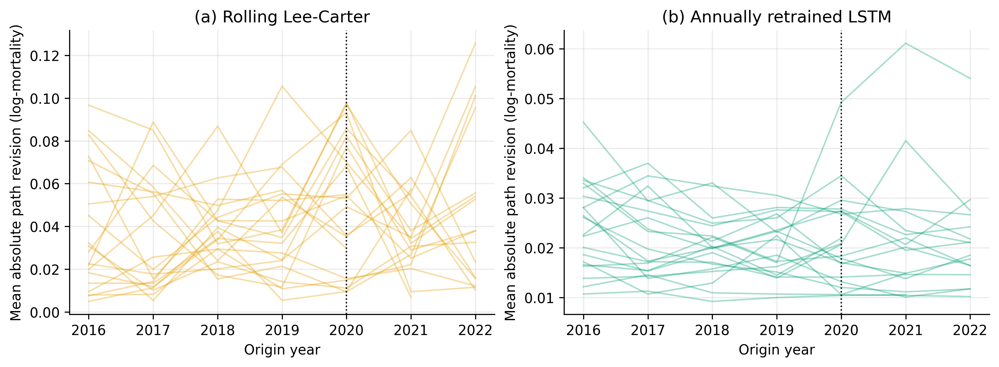

# Introduction

Every mortality forecasting model in production on 1 January 2020 was about to be wrong, everywhere, in the same direction, at once. The COVID-19 pandemic raised death rates across the developed world by margins unseen since 1945, concentrated at the older ages that dominate annuity and pension liabilities [@islam2021excess; @aburto2022quantifying]. For mortality forecasting research, the pandemic is a natural experiment of a kind the literature has never had: a large, sharply dated, exogenous structural break, observed simultaneously across dozens of well-instrumented populations.

This paper uses that experiment to answer a question the deep-learning-for-mortality literature has not yet confronted. A growing body of work benchmarks neural sequence models against the classical Lee--Carter model [@lee1992modeling] on the smooth, trending mortality of 1950--2019: recurrent networks, Transformers [@vaswani2017attention; @wang2024transformer], and efficient-attention variants such as the Performer of @choromanski2021rethinking. In a companion study we showed on twenty populations of the Human Mortality Database that the outcome of that contest is governed not by architecture but by two methodological variables: how far a model must extrapolate beyond its training data, and whether its parameters are re-estimated as new data arrive. Under annual re-estimation, a small LSTM forecasts one year ahead more accurately than annually refitted Lee--Carter in most populations. All of that evidence, however, comes from calm decades. A forecasting system earns its keep in the years when the world misbehaves, and none of the smooth-era evidence says anything about how these model classes absorb, and recover from, a shock.

We therefore ask three questions, each specified and recorded in the version-controlled replication repository before any post-2019 data were examined:

1. **Anatomy of failure.** When frozen models trained through 2019 meet 2020--2023, how do the classical and neural failures compare in size, sign, and age structure? Is the shock simply invisible to all of them, or does architecture matter in a crisis?
2. **Recovery under maintenance.** Once maintained models begin ingesting shock years---Lee--Carter refitted, the LSTM retrained annually---how quickly does each recover its pre-pandemic accuracy, and does the network's short-horizon advantage survive a structural break?
3. **Revision stability.** Actuarial practice cares not only about accuracy but about how violently a model's projections swing when a new data year arrives: forecast revisions drive assumption changes, reserve volatility, and difficult conversations with regulators. We introduce revision stability as a formal evaluation criterion for mortality models---to our knowledge its first quantified use in this literature---and measure how a shock year propagates through each model class's projected path.

The third question exposes a mechanical asymmetry with real actuarial consequences. Lee--Carter's random-walk-with-drift projection is anchored at the jump-off: the final observed year enters the forecast path directly, and the drift estimate is endpoint-sensitive, so a single extreme year shifts the entire projected path by nearly its full magnitude. A trained network, by contrast, filters its inputs through a mapping fitted to sixty-plus years of data; an anomalous input year is smoothed toward the patterns the network has learned. Whether the classical model's transparency comes at the price of over-reaction to outliers---and whether the network's smoothing is a stabiliser or a liability---is exactly what the 2020 data can reveal.

Our contributions are fourfold. First, we provide, to our knowledge, the first systematic comparison of classical and deep mortality models through the COVID-19 break: twenty populations (ten HMD countries, both sexes), four models, frozen and maintained regimes, with data through 2023 where available. Second, we introduce and quantify revision stability, a decision-relevant criterion absent from prior model comparisons. Third, we pre-specified six falsifiable hypotheses in the repository---covering the shock's model-invariance, its age anatomy, recovery speed, calm-period and shock-period revision behaviour, and the persistence of the maintenance advantage---before touching any post-2019 observation, and we report every verdict, including failures. Fourth, all results are reproducible to the digit from fixed seeds, with the full pipeline, pre-registration, and per-population outputs in the replication package.

# Data and models

## Data {#sec-data}

We use single-age central death rates $m_{x,t}$, ages 0--100, from the Human Mortality Database [@hmd] for ten countries---Australia, Canada, Denmark, England and Wales (labelled UK), Finland, France, Italy, Norway, Sweden, and Switzerland---and both sexes: twenty populations. Training data span 1950--2019 throughout; the evaluation window is 2020 to the latest available year (2023 for sixteen populations, 2022 for the UK, 2021 for Australia). Post-2019 HMD data are more recent and subject to revision; we discuss this in @sec-limits. Zero cells at extreme ages are forward-filled along the year axis before the log transform, an imputation audited in the companion study to transfer no test-period information into training years. All modelling is on log-mortality $y_{x,t} = \ln m_{x,t}$; life-expectancy translations use the Chiang life table [@chiang1984life] with the @andreev2015average infant separation factor.

## Models {#sec-models}

The four models, and every hyperparameter, are frozen from the companion study; nothing was tuned for this paper. Lee--Carter is estimated by SVD with the usual identification constraints, and the period index projected as a random walk with drift $\hat d = (\kappa_T - \kappa_1)/(T-1)$. The three networks share the one-step design: a window of $s = 10$ consecutive standardised age profiles predicts the next year's profile; each is trained with Adam (learning rate $10^{-3}$), batch size 32, 100 epochs, mean squared error, in ten independent seeded runs whose dispersion we report. The LSTM [@hochreiter1997long] has one layer of width 32. The Transformer follows @wang2024transformer (one encoder and one decoder layer, two heads, $d_{\text{model}} = 32$, feed-forward 16, dropout 0.1). The Performer replaces its softmax attention with FAVOR+ positive orthogonal random features [@choromanski2021rethinking] at exact parameter parity (21,861 weights each); its implementation is verified against exact attention in the replication package. In the maintained regimes only Lee--Carter and the LSTM are carried forward: the companion study established the LSTM as the strongest network and the attention pair as statistically interchangeable with it or worse, and the shock arm of this study (@sec-shock) re-confirms that architecture is not the operative variable.

## Experimental arms and pre-registration {#sec-design}

Three arms, fixed in advance:

**A. Shock (frozen).** All four models are fitted through 2019 and forecast 2020 onward recursively, with no access to any post-2019 observation. We examine total error, signed bias (observed minus predicted log-mortality, positive when a model under-predicts mortality), its age profile, and the implied life-expectancy error.

**B. Recovery (maintained).** At each origin year $o \in \{2015, \dots, \min(2022, \text{last}-1)\}$, rolling Lee--Carter is refitted on all data through $o$ and the LSTM is retrained from scratch (ten seeds) on the same window; each issues a one-step forecast for $o+1$. Origins 2015--2018 provide each population's calm-period baseline; origins 2019 onward trace the shock and recovery. The **recovery ratio** at origin $o$ is the one-step RMSE at $o$ divided by the same model's mean calm-period RMSE.

**C. Revision stability.** At each origin both maintained models emit a five-year forecast path (Lee--Carter by drift extrapolation; the LSTM by recursive rollout). The **revision** at origin $o$ is the mean absolute change in projected log-mortality, over the target years shared by consecutive paths, between the paths issued at $o-1$ and $o$. Calm-period revisions average origins 2016--2019; the **shock revision** is the value at origin 2020, the first ingestion of a pandemic year.

Six hypotheses (P1--P6) covering the three arms were committed to the repository, with thresholds and directions, before any post-2019 outcome was computed; the only prior contact with post-2019 data was an availability audit. @tbl-prereg reproduces them in abbreviated form.

| # | Pre-registered statement (abbreviated) | Threshold |
|:--|:---------------------------------------|:----------|
| P1 | In 2020 every frozen model under-predicts mortality; between-model spread < half the shock RMSE | ≥18/20; ≥15/20 |
| P2 | 2020 error is disproportionately concentrated at ages 60+ relative to pre-COVID errors | ≥14/20 |
| P3 | Maintained models recover to within 50% of calm-period RMSE by origin 2021 | ≥12/18 |
| P4 | Calm-period path revisions: LSTM > LC | ≥14/20 |
| P5 | Shock-to-calm revision ratio: LC > LSTM | ≥12/20 |
| P6 | Post-shock one-step accuracy: retrained LSTM < rolling LC | ≥11/18 |

: Pre-registered hypotheses (abbreviated; full text with rationales in the repository, timestamped before data contact). {#tbl-prereg}

# Results

## The shock year: an accidental hedge {#sec-shock}

The frozen models' 2020 forecasts cluster tightly---the spread across the four models' shock-year RMSE is less than half the median RMSE itself in all twenty populations, confirming the pre-registered model-invariance of the shock (P1b, 20/20). No architecture saw the pandemic coming, and none failed conspicuously worse than the others.

But the *direction* of the failure contradicts our pre-registration, and the contradiction is instructive. We predicted that every model would under-predict 2020 mortality in nearly every population; in fact all four models under-predict together in only 6 of 20 (P1a, fail). The median signed bias in 2020 is $+0.031$ log points for Lee--Carter---the expected under-prediction---but $-0.003$ to $-0.014$ for the three networks: they *over*-predicted mortality, slightly, in the median population. The mechanism is the central bias documented in our companion work running in reverse. Frozen networks systematically under-extrapolate mortality improvement, projecting rates above the pre-pandemic trend line; when COVID-19 lifted observed mortality above that trend line, the networks' chronic pessimism became an accidental hedge. Their median 2020 RMSE (0.236--0.237) is consequently *below* Lee--Carter's (0.259), and the implied 2020 life-expectancy error is a median $-0.02$ to $-0.03$ years for the networks against $+0.12$ years for Lee--Carter. @fig-bias shows the age anatomy: Lee--Carter's under-prediction is spread across adult ages, while the networks' profiles hover near zero through the COVID-sensitive old ages precisely because their baseline was already pessimistic there.

We stress the correct reading: this is not evidence that networks handle pandemics better. It is evidence that two errors---a chronic trend bias and an acute shock---happened to have opposite signs in 2020. The same bias that cost the networks accuracy throughout 2010--2019 repaid a fraction of it in a single year. A hedge purchased by being persistently wrong is not a risk-management strategy; but the episode does demonstrate, on pre-registered terms, that the shock itself dominated all architectural differences (P1b) while its interaction with each model's baseline bias determined the sign of the miss (P1a's failure).

The pre-registered age-anatomy hypothesis also fails: the share of squared error contributed by ages 60+ in 2020 exceeds the same model's pre-COVID share in only 9 of 20 populations for Lee--Carter (P2; scored exactly for Lee--Carter, whose pre-COVID error profile is deterministic---per-age pre-COVID profiles for the networks were not retained by the earlier pipeline, a scoring limitation we disclose rather than repair post hoc). The explanation is visible in @fig-bias: pre-COVID errors were already concentrated at old ages, so although COVID's excess mortality was itself age-graded, it did not make the error *structure* more old-age-heavy than it already was.

{#fig-bias fig-align="center" width=88%}

## Recovery under maintenance {#sec-recovery}

Maintained systems absorbed the pandemic with almost startling speed. By origin 2021---forecasting 2022 after ingesting two shock years---both the annually refitted Lee--Carter and the annually retrained LSTM sit at their pre-pandemic accuracy level in every population with 2022 data: the recovery ratio (one-step RMSE divided by the same model's calm-period 2016--2019 mean) has median 1.01 for Lee--Carter and 0.95 for the LSTM, within the 1.5 threshold in 18 of 18 populations (P3, pass, at ceiling). One year of pandemic data was disruptive; two sufficed to re-anchor either system. The networks' much-discussed data hunger does not translate into slow shock adaptation, because adaptation here is dominated by the input window and the refreshed jump-off, not by relearning global structure.

The maintenance ranking of the companion study also survives the break intact: pooling one-step forecasts from origins 2020 onward, the retrained LSTM beats rolling Lee--Carter in 17 of 20 populations (P6, pass, against a pre-registered threshold of 11). The short-horizon accuracy advantage of the learned model is not a fair-weather property.

## Revision stability {#sec-revision}

The third arm produces the paper's most decision-relevant finding, and it is the second place our pre-registration was wrong. We expected the retrained network---whose parameters are re-estimated from scratch each year---to produce *noisier* projected paths than the deterministic classical model in calm times, and pre-registered that expectation (P4). The data invert it: over calm origins, the mean absolute year-on-year revision of the five-year projected path is 0.021 log points for the LSTM against 0.040 for Lee--Carter---the network's projections are roughly twice as stable---and Lee--Carter's revisions are larger in 19 of 20 populations (P4: 1/20, decisive failure, in the direction favourable to the network). The mechanism is structural rather than stochastic. Lee--Carter's projected path is anchored on the final observed $\kappa_T$ and an endpoint-sensitive drift, so every new year's idiosyncratic level shifts the whole path nearly one-for-one. The network's forecast is a learned function of ten years of context; a single new year changes one-tenth of its input and is smoothed by a mapping averaged over six decades of training data. Ensemble averaging across seeds contributes, but the per-seed revisions confirm the ordering.

Because male and female series from one country share the same pandemic, the twenty populations are not independent; we therefore re-score every verdict at the country level (ten clusters, a population's country counting as a win when the sexes' mean margin is positive) with exact sign tests. The calm-period inversion is robust to clustering: 9 of 10 countries, $p = 0.02$ (populations: 19/20, $p < 10^{-3}$); so is the maintained accuracy advantage (P6: 10/10 countries, $p = 0.002$). The revision figures use ensemble-mean network paths; the cross-seed dispersion of those paths is small (a conservative two-standard-error criterion still favours the network outright in 8 of 20 populations, with no population favouring Lee--Carter), and the cross-population sign test is the inferential basis.

At the shock, the same mechanism amplifies---but here the evidence is weaker and we flag it. The 2020 ingestion raises Lee--Carter's revision to 1.23 times its own calm level in the median population, while the LSTM's shock revision is *below* its calm level (ratio 0.89). The pre-specified ordering holds in 13 of 20 populations, passing its threshold of 12, but it is not statistically distinguishable from chance (sign test $p = 0.26$; countries 8/10, $p = 0.11$). P5 is therefore recorded as a threshold pass with insufficient inferential support: the medians point the pre-specified way, and a larger cross-section is needed. @fig-rev traces every population's revision path through the pandemic: the classical fan visibly widens at 2020, the network fan barely moves. For reserving practice the translation is direct: a valuation basis tied to rolling Lee--Carter would have absorbed the full 2020 anomaly into its central projection in one step---and partially unwound it the following year---whereas the learned model's assumption path would have moved less in both directions. Stability is not accuracy; but where the two point the same way, as they do here (P6), the case is unusually clean.

{#fig-rev fig-align="center" width=95%}

## Pre-registered verdicts {#sec-verdicts}

| # | Pre-registered statement | Threshold | Result | Verdict |
|:--|:-------------------------|:----------|:-------|:--------|
| P1a | All frozen models under-predict 2020 mortality | ≥18/20 | 6/20 | **Fail** |
| P1b | Model spread < half of shock RMSE | ≥15/20 | 20/20 | Pass |
| P2 | 2020 error more 60+-concentrated than pre-COVID | ≥14/20 | 9/20 (LC) | **Fail** |
| P3 | Recovery to ≤1.5× calm RMSE by origin 2021 | ≥12/18 | 18/18 | Pass |
| P4 | Calm revisions: LSTM > LC | ≥14/20 | 1/20 | **Fail (inverted)** |
| P5 | Shock/calm revision ratio: LC > LSTM | ≥12/20 | 13/20 | Pass |
| P6 | Post-shock one-step accuracy: LSTM < LC | ≥11 | 17/20 | Pass |

: Verdicts on the six pre-registered hypotheses. Failures are reported as committed; P4's failure is directionally inverted (the network is the stable model). {#tbl-verdicts}

# Discussion

Three lessons order the evidence. First, *the shock was architecture-blind but bias-sensitive*. No model class anticipated 2020, and the differences between their shock-year errors were small relative to the shock; what differed was the sign of the miss, determined by each model's pre-existing trend bias. Comparative claims about "robustness to shocks" in this literature should therefore be read as claims about baseline bias, not about shock capture.

Second, *maintenance, not architecture, again does the work*. The finding that organised the companion study's calm-era results---that re-estimation frequency and extrapolation distance dominate model choice---extends through the structural break: maintained systems of either class recovered within two ingestions, and the maintained network retained its accuracy edge (17/20). The pandemic did not reopen the frozen-model contest; it confirmed that the frozen regime is the wrong regime to argue about.

Third, *revision stability deserves a place beside accuracy in mortality model evaluation*. It is measurable, decision-relevant---assumption changes are governed, audited, and expensive---and it discriminated between model classes more sharply than accuracy did (19/20 against 13--17/20 for the accuracy criteria). That the discrimination favoured the learned model surprised us, contradicted our pre-registration, and follows from a mechanism (endpoint anchoring versus windowed smoothing) that is transparent once seen. We offer the metric, its calm/shock decomposition, and the 2020 natural experiment as a template.

## Limitations {#sec-limits}

Post-2019 HMD data are recent and subject to revision, unevenly across countries; our test window ends in 2021--2023 depending on population, and the 2023 figures especially should be considered provisional. The revision metric is computed on ensemble-mean network paths (per-seed results confirm the ordering, and are in the replication package); it measures central-projection stability, not the stability of a full stochastic basis. P2 could be scored exactly only for Lee--Carter, as disclosed. The recovery analysis observes at most three post-shock origins; slower-burning after-effects (long COVID, displaced frailty, delayed diagnoses) lie beyond the window. All conclusions concern point forecasts of central rates in ten developed countries; none of the models was designed for, or is here validated for, pandemic prediction itself. Finally, although every hypothesis, threshold, and design choice predates data contact, the *choice of questions* was informed by mechanisms observed in our own calm-era work; replication on non-HMD populations and later data vintages is the natural next test.

# Conclusion

The pandemic gave mortality forecasting its first common out-of-distribution examination, and the pre-registered answers rearrange the usual debate. In the shock year, architecture was irrelevant and baseline bias decided the sign of the miss---the networks' habitual pessimism briefly became an asset, a result we predicted incorrectly and report as such. In the recovery, both model classes re-anchored within two data ingestions, and the retrained network's short-horizon advantage survived the break. And on the criterion practice may care about most---the stability of the projected path as new data arrive---the classical model's celebrated transparency conceals an endpoint sensitivity that makes its projections twice as volatile as a retrained network's, in calm years and at the shock alike, inverting our own pre-registered expectation. The pandemic's verdict on the classical-versus-deep question is thus neither side's talking point: it is that evaluation regimes, biases, and stability mechanics---not architectures---are where the action is, and that a literature which pre-registers its expectations will occasionally, productively, be wrong.

# Appendix: per-population results {.unnumbered}

| Population | 2020 RMSE LC | LSTM | TF | PF | Calm rev. LC | LSTM | Shock ratio LC | LSTM |
|:--|--:|--:|--:|--:|--:|--:|--:|--:|
| Australia F | 0.253 | 0.271 | 0.271 | 0.278 | 0.0559 | 0.0167 | 0.53 | 1.24 |
| Australia M | 0.185 | 0.202 | 0.204 | 0.213 | 0.0316 | 0.0167 | 1.74 | 1.31 |
| Canada F | 0.242 | 0.210 | 0.206 | 0.205 | 0.0253 | 0.0149 | 1.94 | 1.40 |
| Canada M | 0.221 | 0.183 | 0.170 | 0.164 | 0.0211 | 0.0181 | 3.90 | 2.73 |
| Denmark F | 0.284 | 0.285 | 0.287 | 0.295 | 0.0552 | 0.0307 | 0.64 | 0.90 |
| Denmark M | 0.383 | 0.315 | 0.301 | 0.304 | 0.0411 | 0.0285 | 1.29 | 1.21 |
| Finland F | 0.311 | 0.316 | 0.308 | 0.313 | 0.0407 | 0.0274 | 0.23 | 0.99 |
| Finland M | 0.273 | 0.240 | 0.240 | 0.236 | 0.0386 | 0.0239 | 2.01 | 0.77 |
| France F | 0.142 | 0.115 | 0.113 | 0.112 | 0.0141 | 0.0171 | 1.05 | 0.82 |
| France M | 0.137 | 0.105 | 0.107 | 0.108 | 0.0196 | 0.0194 | 0.57 | 0.62 |
| Italy F | 0.148 | 0.125 | 0.129 | 0.128 | 0.0435 | 0.0158 | 1.97 | 0.67 |
| Italy M | 0.200 | 0.158 | 0.161 | 0.162 | 0.0490 | 0.0190 | 1.11 | 0.69 |
| Norway F | 0.323 | 0.310 | 0.306 | 0.309 | 0.0603 | 0.0313 | 1.16 | 0.85 |
| Norway M | 0.318 | 0.286 | 0.288 | 0.294 | 0.0587 | 0.0327 | 0.61 | 0.90 |
| Sweden F | 0.268 | 0.281 | 0.274 | 0.285 | 0.0230 | 0.0218 | 0.68 | 1.26 |
| Sweden M | 0.265 | 0.233 | 0.234 | 0.239 | 0.0332 | 0.0241 | 2.81 | 0.69 |
| Switzerland F | 0.303 | 0.271 | 0.269 | 0.272 | 0.0472 | 0.0241 | 2.08 | 0.70 |
| Switzerland M | 0.280 | 0.241 | 0.239 | 0.240 | 0.0630 | 0.0252 | 1.54 | 0.71 |
| UK F | 0.148 | 0.151 | 0.151 | 0.155 | 0.0148 | 0.0103 | 0.64 | 1.01 |
| UK M | 0.166 | 0.134 | 0.133 | 0.135 | 0.0233 | 0.0121 | 2.93 | 0.87 |

: Per-population shock-year RMSE (frozen models), calm-period path revisions, and shock-to-calm revision ratios. {#tbl-appendix}

# Declarations {.unnumbered}

**Funding:** [To be completed.] **Conflicts of interest:** none declared. **Data availability:** all data are from the Human Mortality Database (www.mortality.org), subject to its user agreement; the extraction vintage is recorded in the replication repository. **Use of generative AI:** [disclosure per journal policy to be completed by the author.]

# Reproducibility {.unnumbered}

Every number regenerates from fixed seeds: `run_pandemic.py` executes all three arms for all twenty populations (resumable, one JSON and one array archive per population); `PANDEMIC_HYPOTHESES.md` is the pre-registration, committed before the script's first run; models, data pipeline, and the FAVOR+ verification live in `src/`. HMD data are governed by the database's user agreement and are not redistributed.

# References {.unnumbered}

::: {#refs}
:::
