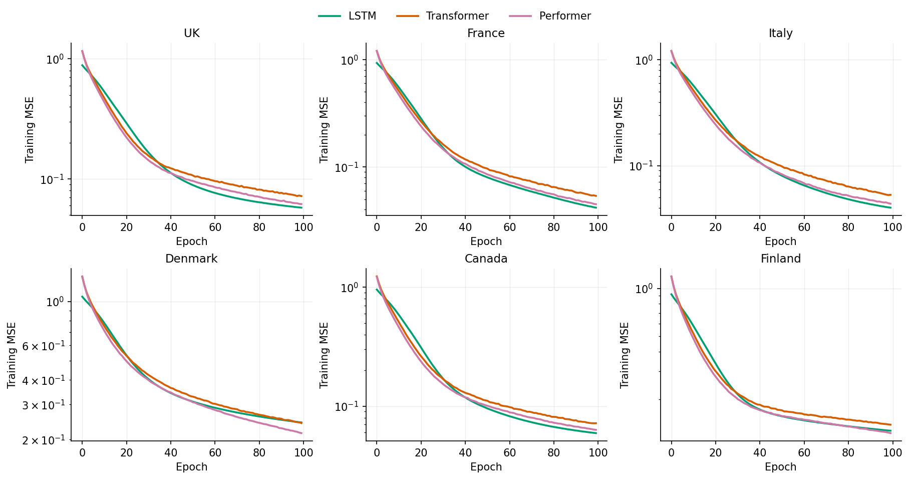
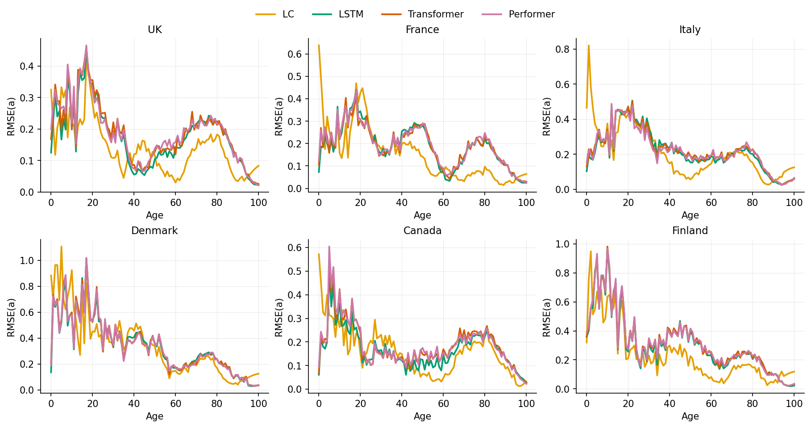
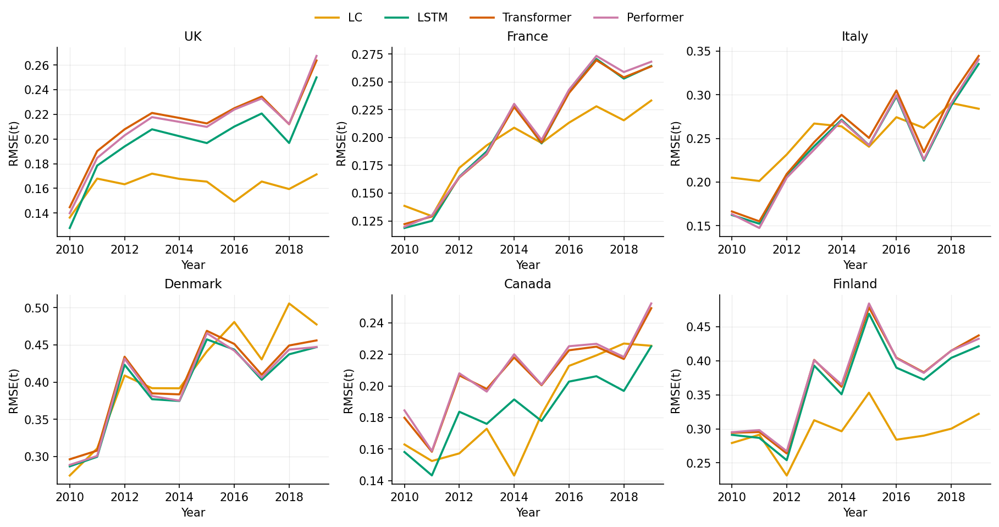
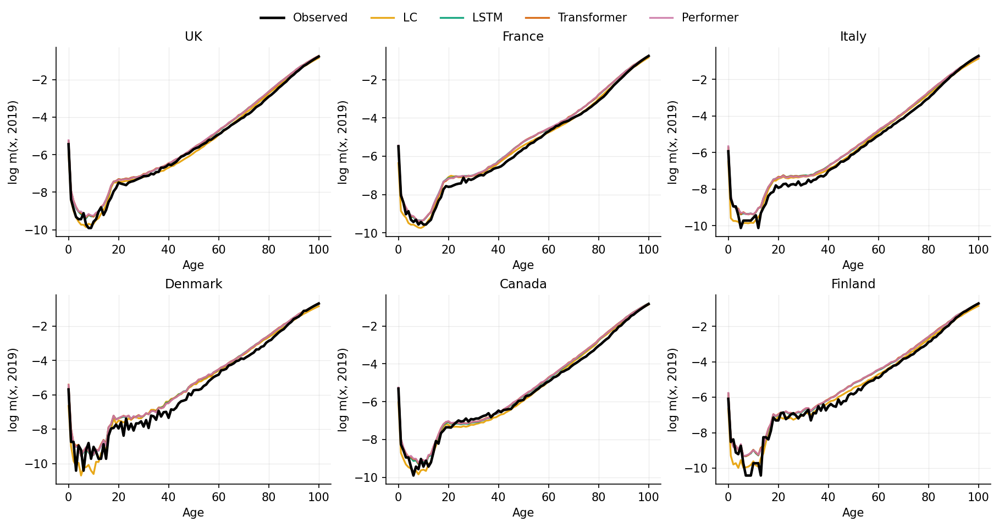

# Introduction

The projection of age-specific mortality underlies the pricing of annuities, the reserving of pension liabilities, and the solvency assessment of life insurers. Since @lee1992modeling, the workhorse for this task has been a factor model that compresses the mortality surface into a single time index with age-specific loadings and projects the index as a random walk with drift. The model's endurance owes less to its fit than to its inductive bias: mortality in developed countries has declined log-linearly for half a century, and Lee--Carter extrapolates exactly such a trend.

A growing literature asks whether modern sequence models can do better. Recurrent networks and their gated variants have been applied to mortality with mixed results [@perla2021timeseries; @nigri2019deep], and @wang2024transformer recently reported that a compact Transformer [@vaswani2017attention] outperforms Lee--Carter and neural baselines across eight countries---a result our companion replication study was unable to reproduce from the paper's published description. The Transformer's distinguishing feature is self-attention, which compares every year in the input window with every other at a cost quadratic in the window length. That cost has motivated a family of *efficient attention* mechanisms, of which the Performer of @choromanski2021rethinking is the most prominent: it approximates the softmax attention kernel with positive orthogonal random features, reducing the complexity from quadratic to linear while remaining an unbiased estimator of the original attention matrix. Linear attention has also been derived directly [@katharopoulos2020transformers].

Whether such mechanisms help or harm in actuarial applications is an open question, and not an idle one. Mortality forecasting sits at the opposite end of the data spectrum from the language and vision tasks for which efficient attention was designed: windows of ten years rather than thousands of tokens, and a few dozen training examples rather than billions. In this regime the Performer's random-feature approximation is not a computational necessity but a form of stochastic regularisation, and its effect on accuracy is an empirical matter. This paper answers three questions:

1. **Does the Performer work for mortality forecasting?** We provide, to our knowledge, the first application of FAVOR+ attention to age-specific mortality, in an architecture matched parameter-for-parameter to a standard Transformer, so that any difference in accuracy is attributable to the attention mechanism alone.
2. **How do the attention models compare with a strong recurrent baseline and with the classical benchmark when the comparison is scrupulously fair?** Four models---Lee--Carter, a long short-term memory network, the Transformer, and the Performer---see the same data, the same splits, and the same metrics; every network is trained ten times from independent seeds; and every model forecasts the test period from the same information.
3. **How much do the evaluation choices matter?** We repeat the entire exercise under two train/test splits with different forecast horizons, and under two test-time protocols---recursive multi-year projection and rolling one-step prediction---to establish that the conclusions are not artefacts of a single design.

The LSTM serves as the neural baseline because it was the strongest of the four network architectures in our companion replication study; carrying weaker baselines adds noise without information. The empirical setting is male mortality at single ages 0--100 in six countries of the Human Mortality Database [@hmd].

# Background

## The Lee–Carter model {#sec-lc}

Write $m_{x,t}$ for the central death rate at age $x$ in year $t$ and $y_{x,t} = \ln m_{x,t}$. Lee--Carter decomposes the log-mortality surface as

$$
y_{x,t} = \alpha_x + \beta_x \,\kappa_t + \varepsilon_{x,t},
\qquad \sum_x \beta_x = 1, \quad \sum_t \kappa_t = 0,
$$ {#eq-lc}

where $\alpha_x$ is the average age profile, $\kappa_t$ a period index, and $\beta_x$ the sensitivity of age $x$ to the index; the constraints identify the factors. We estimate the model as in the original paper: $\alpha_x$ is the row mean over the training years and the leading singular vectors of the centred surface supply $\beta_x$ and $\kappa_t$. The index is projected as a random walk with drift,

$$
\kappa_{t+1} = \kappa_t + d + \xi_{t+1},
\qquad
\hat{d} = \frac{\kappa_T - \kappa_1}{T-1},
$$ {#eq-rwd}

so the point forecast $h$ years ahead is $\hat{\kappa}_{T+h} = \kappa_T + h\hat{d}$, mapped to rates through @eq-lc. The estimation is deterministic; there is no run-to-run variation. Richer stochastic mortality models exist [e.g. @cairns2006two], but Lee--Carter remains the canonical benchmark against which neural alternatives are judged.

## The forecasting task and the LSTM baseline {#sec-lstm}

All networks learn the same one-step map. Let $\mathbf{y}_t \in \mathbb{R}^{A}$ collect the log-rates of the $A = 101$ ages in year $t$, standardised age by age with training-period statistics. Given a window of $s = 10$ consecutive years, the network predicts the next:

$$
\hat{\mathbf{y}}_{t} = g\left(\mathbf{y}_{t-s}, \dots, \mathbf{y}_{t-1}\right).
$$ {#eq-task}

The long short-term memory network [@hochreiter1997long] processes the window sequentially through a hidden state $\mathbf{h}_t$ of width 32, regulated by input, forget, and output gates:

$$
\begin{aligned}
\mathbf{i}_t &= \sigma\left(W_i \mathbf{y}_t + U_i \mathbf{h}_{t-1} + \mathbf{b}_i\right), &
\mathbf{f}_t &= \sigma\left(W_f \mathbf{y}_t + U_f \mathbf{h}_{t-1} + \mathbf{b}_f\right), \\
\mathbf{o}_t &= \sigma\left(W_o \mathbf{y}_t + U_o \mathbf{h}_{t-1} + \mathbf{b}_o\right), &
\mathbf{g}_t &= \tanh\left(W_g \mathbf{y}_t + U_g \mathbf{h}_{t-1} + \mathbf{b}_g\right), \\
\mathbf{c}_t &= \mathbf{f}_t \odot \mathbf{c}_{t-1} + \mathbf{i}_t \odot \mathbf{g}_t, &
\mathbf{h}_t &= \mathbf{o}_t \odot \tanh(\mathbf{c}_t),
\end{aligned}
$$ {#eq-lstm}

with $\sigma$ the logistic function and $\odot$ the elementwise product; the gates protect the cell state $\mathbf{c}_t$ from the gradient decay that limits plain recurrences. A linear head maps the final hidden state to the predicted age profile.

## The Transformer {#sec-transformer}

The Transformer dispenses with recurrence. Each year's profile is embedded linearly into $\mathbb{R}^{d}$ with $d = 32$ and tagged with a sinusoidal positional encoding,

$$
\text{PE}_{t,2i} = \sin\left(\frac{t}{10000^{\,2i/d}}\right),
\qquad
\text{PE}_{t,2i+1} = \cos\left(\frac{t}{10000^{\,2i/d}}\right),
$$ {#eq-pe}

after which layers of scaled dot-product attention let every position attend to every other:

$$
\text{Attention}(Q, K, V) = \text{softmax}\left(\frac{Q K^\top}{\sqrt{d_k}}\right) V,
$$ {#eq-attn}

with queries $Q$, keys $K$, and values $V$ obtained as linear projections of the embedded sequence and two attention heads running in parallel. Each sub-layer is wrapped in residual connections with layer normalisation. The configuration follows @wang2024transformer: one encoder and one decoder layer, feed-forward width 16, dropout 0.1, no decoder masking, the decoder attending over the same embedded input as the encoder, and the prediction read from the final position. Computing @eq-attn costs $\mathcal{O}(s^2 d)$ per window.

## The Performer and FAVOR+ attention {#sec-performer}

The Performer [@choromanski2021rethinking] replaces the softmax kernel in @eq-attn with an unbiased random-feature estimate that never forms the $s \times s$ attention matrix. The object being approximated is the kernel $\text{SM}(\mathbf{q}, \mathbf{k}) = \exp(\mathbf{q}^\top \mathbf{k} / \sqrt{d_k})$. Rescaling $\mathbf{q}' = \mathbf{q}/d_k^{1/4}$ and $\mathbf{k}' = \mathbf{k}/d_k^{1/4}$, the identity

$$
\exp(\mathbf{q}'^\top \mathbf{k}') \;=\;
\mathbb{E}_{\boldsymbol{\omega} \sim \mathcal{N}(0, I_{d_k})}
\left[\, \phi_{\boldsymbol{\omega}}(\mathbf{q}')\, \phi_{\boldsymbol{\omega}}(\mathbf{k}') \,\right],
\qquad
\phi_{\boldsymbol{\omega}}(\mathbf{u}) = \exp\left(\boldsymbol{\omega}^\top \mathbf{u} - \tfrac{1}{2}\lVert \mathbf{u} \rVert^2\right),
$$ {#eq-favor-kernel}

expresses the softmax kernel as an expectation over Gaussian directions $\boldsymbol{\omega}$. Drawing $m$ such directions and stacking the *positive* features

$$
\phi(\mathbf{u}) = \frac{1}{\sqrt{m}}
\left( \phi_{\boldsymbol{\omega}_1}(\mathbf{u}), \dots, \phi_{\boldsymbol{\omega}_m}(\mathbf{u}) \right)^\top
$$ {#eq-favor-features}

gives $\text{SM}(\mathbf{q}, \mathbf{k}) \approx \phi(\mathbf{q}')^\top \phi(\mathbf{k}')$, with positivity guaranteeing a stable, non-negative estimate of every attention weight. Attention then factorises: writing $\phi(Q), \phi(K) \in \mathbb{R}^{s \times m}$ for the feature matrices,

$$
\text{FAVOR+}(Q, K, V) \;=\; D^{-1}\, \phi(Q) \left( \phi(K)^\top V \right),
\qquad
D = \text{diag}\left( \phi(Q)\, \phi(K)^\top \mathbf{1}_s \right),
$$ {#eq-favor-attn}

computed left-to-right in $\mathcal{O}(s\,m\,d_k)$ time and memory---linear in the sequence length. Two refinements from the original paper are implemented: the $m$ directions are drawn *orthogonally* (blockwise QR of a Gaussian matrix, rows rescaled to chi-distributed norms), which provably reduces the estimator's variance, and the exponentials are computed with max-subtraction stabilisers that cancel in the normalised ratio @eq-favor-attn.

Our Performer is the Transformer of @sec-transformer with @eq-attn replaced by @eq-favor-attn and nothing else changed: same embedding, positional encoding, layer count, heads, feed-forward width, dropout, residual and normalisation structure, and output head. Both models have exactly 21,861 trainable parameters; the random features are fixed at initialisation, drawn once per seed, and stored with the model. We set $m = 48 \approx d_k \ln d_k$ for head dimension $d_k = 16$, the guideline of @choromanski2021rethinking. The implementation was verified directly: on random inputs the FAVOR+ output converges monotonically to exact softmax attention as $m$ grows, at the expected $\mathcal{O}(1/\sqrt{m})$ rate.

At a window length of $s = 10$, linear attention offers no computational advantage; the interest of the comparison is statistical. The random-feature map injects noise into every attention evaluation, which could act as a regulariser in a small-sample training problem---or could simply degrade an already difficult fit. Which effect dominates is what the experiment measures.

# Data and experimental design

## Data {#sec-data}

We use single-age male central death rates for ages 0--100 and years 1950--2019 from the Human Mortality Database for six countries: England and Wales (labelled UK), France, Italy, Denmark, Canada, and Finland. Zero cells at the highest ages in the smaller populations, which denote absent exposure, are carried forward along the year axis before taking logarithms. The sample begins in 1950 deliberately: earlier records contain the two world wars, the 1918 influenza pandemic, and changing data-quality regimes, and training a trend-following forecaster on war-shock years imports dynamics that are irrelevant to the post-war mortality decline. This is the convention of the applied literature, and it also equalises coverage across countries.

## Two splits and two protocols {#sec-design}

All results are reported under two train/test splits. The **extended split**---training on 1950--2009 (60 years, 50 moving windows) and testing on 2010--2019 (10 years)---is the primary design: it maximises the training data available to the networks and evaluates them at a horizon typical of actuarial valuation work. The **benchmark split**---training on 1950--2000 (51 years, 41 windows) and testing on 2001--2019 (19 years)---is retained for comparability with @wang2024transformer and with our companion replication study. If a model class is genuinely superior, its advantage should survive the move from one split to the other; if a conclusion flips between splits, it was an artefact of the design rather than a property of the models.

The benchmark enforces the same symmetries throughout. Every model is fitted to the identical log-mortality matrix, with per-age standardisation statistics estimated on training years only. Every network learns the one-step map @eq-task and is trained with mean squared error, Adam at learning rate $10^{-3}$, batch size 32, and 100 epochs, in ten independent runs (seeds 0--9) whose means and standard deviations we report. Test forecasts are generated under two protocols. Under the primary **recursive** protocol the window is seeded with the last ten training years and each prediction is fed back as an input, so that no model observes any test-period data while forecasting---the same information set as the Lee--Carter extrapolation. Under the **rolling** protocol each test year is predicted from the ten *observed* years preceding it, with Lee--Carter refitted annually on all data to date; the contrast between protocols isolates how much of a model's error is attributable to stale inputs rather than to the learned mapping.

Accuracy is measured by mean absolute error, root mean squared error, and mean absolute percentage error on the log scale, together with the age-wise and year-wise decompositions

$$
\text{RMSE}(x) = \sqrt{\frac{1}{T}\sum_{t} \left(\hat{y}_{x,t} - y_{x,t}\right)^2},
\qquad
\text{RMSE}(t) = \sqrt{\frac{1}{A}\sum_{x} \left(\hat{y}_{x,t} - y_{x,t}\right)^2}
$$ {#eq-rmse-decomp}

of @li2017coherent.

# Results

## In-sample fit {#sec-train}

@tbl-train reports training-period RMSE for the three networks on the primary (extended) split; the benchmark split behaves identically and is tabulated in the repository. The clearest in-sample fact concerns the Performer: it achieves the lowest training RMSE of the three networks in all six countries on the extended split, and in eleven of the twelve country--split cells overall (the exception is the United Kingdom on the benchmark split, where the LSTM leads). The margins are a few per cent, but their consistency across countries, splits, and seeds shows that the random-feature attention, far from impairing the fit, mildly improves it. The training-loss curves (@fig-loss) descend smoothly to a common plateau for all three architectures; the FAVOR+ approximation does not destabilise optimisation at this scale.

| Country | LSTM | Transformer | Performer |
|:--------|:-----|:------------|:----------|
| UK | 0.0625 (0.0011) | 0.0648 (0.0015) | **0.0622** (0.0008) |
| France | 0.0602 (0.0018) | 0.0609 (0.0023) | **0.0587** (0.0019) |
| Italy | 0.0711 (0.0017) | 0.0735 (0.0024) | **0.0703** (0.0019) |
| Denmark | 0.1618 (0.0011) | 0.1564 (0.0028) | **0.1499** (0.0024) |
| Canada | 0.0763 (0.0014) | 0.0765 (0.0011) | **0.0750** (0.0009) |
| Finland | 0.1646 (0.0009) | 0.1641 (0.0021) | **0.1571** (0.0025) |

: In-sample RMSE on log-mortality, extended split (train 1950--2009), mean over ten runs with standard deviation in parentheses. Bold marks the best network per country. {#tbl-train}

{#fig-loss fig-align="center" width=95%}

## Out-of-sample accuracy {#sec-test}

@tbl-test-ext presents the central result on the primary split: test RMSE for 2010--2019 under the recursive protocol, in which every model forecasts ten years ahead from training-period information alone. @tbl-test-paper gives the corresponding results on the benchmark split, whose 19-year horizon and shorter training window reproduce the setting of @wang2024transformer.

| Country | LC | LSTM | Transformer | Performer |
|:--------|:---|:-----|:------------|:----------|
| UK | **0.1621** | 0.2007 (0.0025) | 0.2148 (0.0061) | 0.2128 (0.0041) |
| France | **0.1957** | 0.2115 (0.0037) | 0.2114 (0.0072) | 0.2139 (0.0064) |
| Italy | 0.2537 | **0.2485** (0.0055) | 0.2552 (0.0075) | 0.2489 (0.0053) |
| Denmark | 0.4173 | **0.3992** (0.0029) | 0.4084 (0.0086) | 0.4026 (0.0057) |
| Canada | 0.1881 | **0.1875** (0.0041) | 0.2090 (0.0076) | 0.2106 (0.0058) |
| Finland | **0.2976** | 0.3689 (0.0037) | 0.3793 (0.0075) | 0.3800 (0.0059) |

: Test RMSE, extended split (test 2010--2019, recursive protocol), mean over ten runs with standard deviation in parentheses. Lee--Carter is deterministic. Bold marks the best model per country. {#tbl-test-ext}

| Country | LC | LSTM | Transformer | Performer |
|:--------|:---|:-----|:------------|:----------|
| UK | **0.2016** | 0.3332 (0.0019) | 0.3450 (0.0060) | 0.3422 (0.0051) |
| France | **0.2656** | 0.3688 (0.0128) | 0.3932 (0.0120) | 0.3973 (0.0117) |
| Italy | **0.3115** | 0.4515 (0.0063) | 0.4638 (0.0213) | 0.4618 (0.0172) |
| Denmark | **0.4731** | 0.4948 (0.0056) | 0.5286 (0.0413) | 0.5102 (0.0241) |
| Canada | **0.2129** | 0.2943 (0.0074) | 0.3119 (0.0077) | 0.3065 (0.0056) |
| Finland | **0.3290** | 0.4318 (0.0043) | 0.4511 (0.0090) | 0.4435 (0.0053) |

: Test RMSE, benchmark split (test 2001--2019, recursive protocol), mean over ten runs with standard deviation in parentheses. Bold marks the best model per country. {#tbl-test-paper}

The contrast between the two tables is the paper's most consequential empirical fact. On the benchmark split the classical model dominates without qualification: Lee--Carter has the lowest RMSE in all six countries, and the best network trails it by between 4.6 per cent (Denmark) and 65 per cent (United Kingdom), with 31--45 per cent typical. On the extended split---nine more training years, nine fewer forecast years---the picture changes qualitatively. The networks' errors fall by roughly 40 per cent while Lee--Carter's fall by roughly 15, and the point-estimate ranking inverts in half the countries: the LSTM records the lowest RMSE in Italy ($-2.0$ per cent relative to LC), Denmark ($-4.3$ per cent, where all three networks sit below the classical model), and Canada (a dead heat at $-0.3$ per cent, well inside seed noise).

Formal testing keeps the score honest. Applying a Diebold--Mariano-style one-sample test to the ten annual mean-squared-error differentials between the LSTM and Lee--Carter, the classical model's extended-split wins in the United Kingdom ($p = 0.002$) and Finland ($p = 0.001$) are statistically significant, while none of the networks' point-estimate wins is: Italy gives $p = 0.62$, Denmark $p = 0.09$, and Canada $p = 0.93$ (France, $p = 0.07$, leans to Lee--Carter). With ten annual observations the test is indicative rather than sharp, but the asymmetry is clear. The correct summary of the extended split is therefore not that the networks overtake the classical model; it is that they pull statistically level with it in four of six countries, having trailed it significantly---by 31 to 65 per cent---on the benchmark split.

Two qualifications discipline the headline. First, the networks' extended-split wins are strongest on RMSE: on mean absolute error Lee--Carter still leads in five of the six countries (Denmark is the exception), which says the networks' advantage comes from trimming the largest errors---predominantly at young ages, as @sec-structure shows---rather than from a uniformly better fit. Second, within the network family the ordering is stable across both splits: the LSTM leads everywhere it matters, and the attention models sit behind it in ten of twelve country--split cells (the exception is France on the extended split, where all three networks are within 0.003 of one another).

## Performer versus Transformer {#sec-pf-vs-tf}

The matched pair in the last two columns of the test tables isolates the effect of replacing exact softmax attention with the FAVOR+ approximation, all else equal. On the benchmark split the Performer's mean RMSE is lower in five of six countries (by 0.002 to 0.018; France is the exception at 0.004 higher); on the extended split it is ahead in three and behind in three, with three of those margins under 0.003. Because the runs share seeds, the comparison admits a paired test, and the paired verdict is the honest one: across the twelve country--split cells, exactly one paired-by-seed $t$-test reaches significance at the 5 per cent level (Finland on the benchmark split, in the Performer's favour)---no more than the false-positive rate would produce. Out of sample, the two attention models are statistically indistinguishable.

Two descriptive regularities nonetheless survive intact and point the same way. The Performer's run-to-run standard deviation is smaller than the Transformer's in all twelve cells, often by a third (Denmark, benchmark split: 0.024 against 0.041), and it achieves the best in-sample fit of the three networks in eleven of twelve cells. The measured conclusion is that the random-feature approximation acts as a mild variance-reducing regulariser: it costs nothing in accuracy, buys reproducibility across seeds, and never behaves as a lossy shortcut. Equally, it never rescues the attention architecture from the LSTM, which sits at or above both attention models throughout.

The computational case for the Performer is absent at these dimensions, and honesty requires saying so: with ten-year windows the fixed overhead of the feature maps makes our Performer roughly a third slower than our Transformer in wall-clock terms, because the linear-versus-quadratic crossover lies far beyond $s = 10$. The case for the Performer in actuarial work is therefore statistical at present; it would become computational in settings with genuinely long sequences, such as monthly surveillance series or multi-population models over concatenated histories.

## Error structure by age and horizon {#sec-structure}

{#fig-rmsea fig-align="center" width=95%}

{#fig-rmset fig-align="center" width=95%}

{#fig-2019 fig-align="center" width=95%}

The age decomposition (@fig-rmsea) shows that on the extended split the classical and neural errors are *complementary* rather than ordered. The networks retain a hump at ages 60--85---attenuated relative to the benchmark split but present in every country---while Lee--Carter now exhibits pronounced error spikes at infancy and childhood, reaching 0.6--0.8 at age 0 in France, Italy, and Canada where the networks stay near 0.1--0.2. The mechanism is the mirror image of the networks' weakness: infant mortality improvement decelerated toward its biological floor during the test decade, and the constant drift in $\kappa_t$, estimated over sixty years of much faster improvement, extrapolates straight past the floor. The networks, whose training window now includes the deceleration years 2001--2009, track the flattening. Denmark and Italy---the countries where the networks win overall---are precisely those where the young-age share of total error is largest.

The year decomposition (@fig-rmset) makes the horizon-dependence visible directly: all errors grow with forecast distance, but in Denmark the Lee--Carter curve crosses *above* all three networks from about 2015, and in Italy from about 2013, while in the United Kingdom, France, and Finland it stays below throughout. The 2019 age profiles (@fig-2019) summarise how much easier the ten-year problem is than the nineteen-year one: every model now tracks the observed profile closely, the networks sitting slightly above observed mortality at working ages and Lee--Carter slightly below at young ages---the residue, in both cases, of the biases just described.

## Sensitivity to the forecasting protocol {#sec-protocol}

| Country | LC, recursive | LC, rolling | Performer, recursive | Performer, rolling |
|:--------|-------------:|-----------:|---------------------:|-------------------:|
| UK | 0.1621 | **0.1294** | 0.2128 | 0.2144 |
| France | 0.1957 | **0.1517** | 0.2139 | 0.2104 |
| Italy | 0.2537 | **0.1979** | 0.2489 | 0.2521 |
| Denmark | 0.4173 | **0.3362** | 0.4026 | 0.4120 |
| Canada | 0.1881 | **0.1544** | 0.2106 | 0.2106 |
| Finland | 0.2976 | **0.2810** | 0.3800 | 0.3871 |

: Test RMSE under the two forecasting protocols, extended split. Under the rolling protocol the observed profiles of the preceding ten years enter each input window, and Lee--Carter is refitted annually on all data to date. Bold marks the best value in each row. {#tbl-protocol}

The protocol experiment resolves the extended-split ambiguity decisively in the classical model's favour. Handing the networks the observed recent history barely moves them: the Performer changes by at most 0.009 and worsens in four of six countries, and the LSTM improves by at most 0.010 (its rolling best, 0.1855 in Canada, remains 20 per cent behind rolling Lee--Carter). The identical information reduces Lee--Carter's RMSE by 6 to 23 per cent on this split---and by 14 to 46 per cent on the benchmark split, where the same asymmetry holds. The interpretation is the same as in our replication study: the networks' residual error lives in the learned one-step mapping, not in the inputs, so fresh data cannot repair it, whereas Lee--Carter converts fresh data directly into an updated drift estimate.

The consequence is that the strongest practical claim survives both splits and both protocols intact: **annually refitted Lee--Carter beats every network, under every protocol, in every country, on both splits**---its extended-split error is 15 to 32 per cent below that of the best network in its best configuration. The networks' recursive-mode wins in Italy, Denmark, and Canada are wins against a straw man: a Lee--Carter model frozen for a decade. Against the classical model as actually used, with its trivial annual refit, no neural configuration tested here comes close.

# Discussion

## The binding constraint is extrapolation distance {#sec-why}

Read together, the two splits locate the networks' weakness precisely. It is not capacity: in-sample, all three networks fit the data as well as their out-of-sample winner fits its. It is not information: handing them observed test data barely moves their errors. It is the distance they are asked to extrapolate beyond the support of their training data. Over nineteen recursive years the standardised inputs drift far below anything seen in training, the networks' outputs regress toward training-period levels, and they lose to a frozen Lee--Carter by 30--65 per cent. Over ten years the drift is modest, the regression bias small, and the same architectures pull statistically level with the frozen classical model in most countries---ahead of it on the point estimate in Denmark and Italy. A network's effective forecast range appears to be a property of its training distribution, not of its architecture: no amount of attention engineering moved it, and nine additional training years covering the improvement slowdown moved it substantially.

The age decomposition sharpens the point into something actuarially useful. Lee--Carter's constant drift is an asset exactly where mortality decline has been steady (old ages) and a liability where the decline has hit a floor (infancy); the networks' data-driven flexibility is the reverse. The two model families fail in complementary places, which is the classic precondition for combination---whether by age-blending forecasts, by hybrid designs that let a neural network forecast the Lee--Carter index [@nigri2019deep], or by multi-population architectures with structural trend components [@perla2021timeseries]. Our results suggest such combinations, rather than head-to-head replacement, are where the practical gains lie.

## What the Performer contributes {#sec-pf-contribution}

The Performer's role in this study is deliberately surgical, and its verdict is correspondingly clean. As the first application of FAVOR+ attention to mortality forecasting, it establishes feasibility: the random-feature attention trains stably on 41--50 windows, fits in-sample better than either competitor almost everywhere, and matches the exact-attention Transformer out of sample while being reliably less sensitive to the seed. For a practitioner the last property has independent value---a model whose accuracy depends less on the training run is a model whose validation figures are more trustworthy. But the Performer also inherits, unchanged, the attention family's deficit against the gated recurrence: across all twelve country--split cells, neither attention model ever beats the LSTM. Efficient attention refines the attention model; it does not change what kind of model wins.

## Implications for practice {#sec-practice}

Three operational lessons follow. First, the comparison that matters is against Lee--Carter *as actually used*. The networks' extended-split wins evaporate against an annually refitted classical model, which costs seconds to update and leads everywhere; deep learning claims benchmarked against a decade-frozen Lee--Carter overstate their practical relevance. Second, the evaluation design can decide the result before any model is trained: moving the split boundary by nine years turned a classical lead that was significant everywhere into one that is statistically undetectable in four of six countries. Forecasting studies should therefore report multiple horizons, explicit information sets, formal loss-differential tests, and multi-seed dispersion as a matter of course. Third, where deep models are deployed for short-horizon work, our evidence favours the LSTM over both attention architectures at this data scale, with the Performer preferable to the Transformer if an attention model is required, on stability grounds.

## Limitations {#sec-limits}

Four methodological caveats deserve the same prominence as the findings. First, the extended split was designed after the benchmark-split results were known, and its test decade (2010--2019) is a subset of the benchmark test window (2001--2019); the two splits are therefore not independent evidence, and the horizon-dependence finding, however mechanistically plausible, is exploratory rather than confirmatory. It should be re-tested out of design---on other countries, other decades, or female mortality. Second, our dispersion measures understate total uncertainty: the seed standard deviations capture training stochasticity but not sampling variation over a ten-year test window, and the loss-differential tests rest on ten annual observations without serial-correlation correction. Third, the zero-cell imputation was audited directly---no training-year cell is ever filled from a test-year observation in any country, under either split---but the audit covers only this preprocessing step; standardisation and window construction are leakage-free by construction. Fourth, the mean absolute percentage error is computed on the log scale, inherited from the literature we compare against; because the denominator $\lvert \ln m \rvert$ shrinks at the oldest ages, the metric overweights them, and we treat it as tertiary.

The remaining limitations are of scope. We model male mortality in six developed countries; smoother total-population series may narrow the gaps further, and structurally disrupted regimes may widen them. The window length, feature count ($m = 48$, the $d_k \ln d_k$ guideline, not swept), and training regime are fixed, documented choices applied symmetrically rather than tuned per model. Point forecasts are the sole object of study: none of the networks as configured produces the stochastic scenarios that reserving and solvency work require. Finally, the test decade ends in 2019 by construction; none of these models has been asked about a pandemic.

# Conclusion

This paper introduced the Performer to mortality forecasting and benchmarked it, under strictly symmetric conditions, against an exactly parameter-matched Transformer, an LSTM, and the Lee--Carter model, across six countries, two train/test splits, two forecasting protocols, and ten seeds per network. The findings are three. The Performer works: FAVOR+ attention trains stably on small actuarial samples, delivers the best in-sample fit of any network in eleven of twelve settings, and is statistically indistinguishable from the Transformer out of sample while showing uniformly lower seed variance---so efficient attention costs nothing statistically, even where it cannot yet pay computationally. The horizon governs the contest: lengthening training by nine years and shortening the forecast to ten collapses a classical lead that was significant in all six countries to one detectable in only two, revealing that the networks' true limitation is extrapolation distance rather than architecture. And the classical model, used as practitioners actually use it---refitted each year---remains undefeated in every cell of the experiment.

The burden of proof therefore still rests with the neural newcomers, but this study narrows where the proof must come from: not from further refinement of the attention mechanism, which we have shown changes little, but from designs that give data-driven models a structural capacity to extrapolate---and from evaluations honest enough to compare them against a classical benchmark that is allowed to do the same.

# Reproducibility {.unnumbered}

Every number in this paper is generated by our own code from raw HMD records and regenerates exactly from fixed seeds. The pipeline is `run_experiment.py`; data preparation, the models (including the FAVOR+ implementation in `src/performer.py`), training, evaluation, and plotting live in `src/`; per-run and aggregated metrics are written to `outputs/results/` and figures to `outputs/figures/`. Running `python run_experiment.py --epochs 100 --runs 10` reproduces all tables and figures for both splits. The correctness of the FAVOR+ implementation is verified by a convergence test against exact softmax attention. HMD data are governed by the database's user agreement and are not redistributed.

# References {.unnumbered}

::: {#refs}
:::
