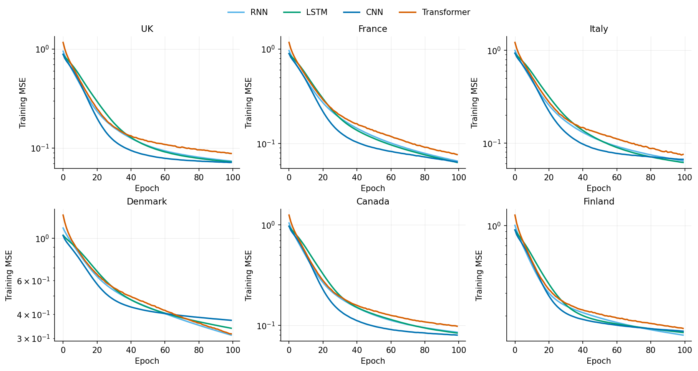
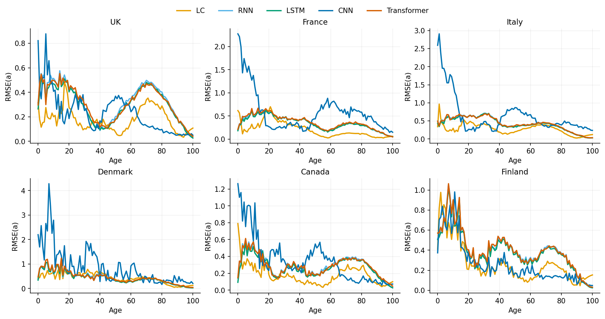
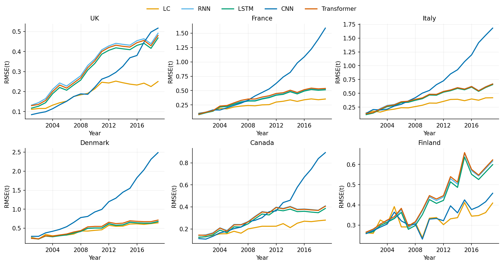
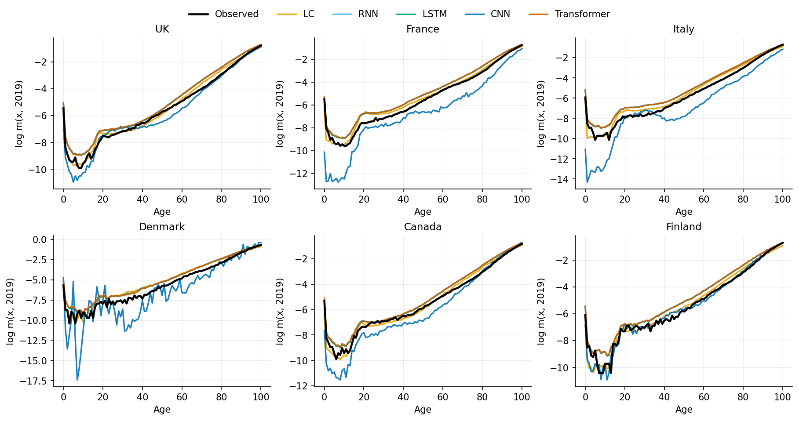

# Introduction

@wang2024transformer proposed applying the Transformer architecture [@vaswani2017attention] to age-specific mortality forecasting and reported that it outperformed the Lee-Carter model [@lee1992modeling] and three neural network baselines (RNN, LSTM, CNN) across eight countries drawn from the Human Mortality Database [@hmd]. Because the paper reports strong headline results but leaves several implementation details unspecified, an independent replication is a natural test of how robust its conclusions are to reimplementation from the published description alone.

This report documents such a replication. We reimplement the full experimental pipeline --- data preparation, the Transformer exactly as specified in the paper's hyperparameter table, the three deep learning baselines, the Lee-Carter benchmark, the training protocol, and the evaluation metrics --- and run it on the subset of the paper's countries available in our local HMD extract. All results, tables, and figures in this report are produced by our own code from raw HMD data; nothing is reproduced from the original publication.

Two questions guide the exercise:

1. **Reproducibility of the ranking.** Does the Transformer beat LC, RNN, LSTM, and CNN on held-out test years when the experiment is rebuilt from the paper's description?
2. **Sensitivity to unstated choices.** The paper omits the moving-window length, the optimizer, the input scaling, the forecasting protocol on the test set, and the baseline configurations. How much interpretive freedom do these gaps leave, and does the headline conclusion survive them?

# Data

## Source and scope

We use single-age central death rates $m(x,t)$ from the Human Mortality Database, ages $0$--$100$ ($A = 101$ age groups) and calendar years 1950--2019, matching the paper's data window. The paper studies eight countries; our local extract covers six of them, which defines the replication scope:

| Paper country | Our HMD series | Note |
|:--------------|:---------------|:-----|
| UK | GBRTENW | England & Wales population used as UK proxy |
| France | FRATNP | Total-population series |
| Italy | ITA | --- |
| Denmark | DNK | --- |
| Canada | CAN | --- |
| Finland | FIN | --- |

: Country coverage of the replication. Spain and Japan are omitted for lack of local data. {#tbl-countries}

Two deviations from the source paper are unavoidable and are stated up front. First, Spain and Japan are excluded. Second, the paper does not state which population (male, female, or total) it models; we use **male** mortality throughout. Consequently our error levels are not directly comparable with the paper's numerically --- male mortality is more volatile than total-population mortality, particularly at young-adult ages --- but the *relative ranking* of the five models, which is the paper's central claim, is fully testable.

## Preprocessing and split

All modelling is done on log-mortality $y_{x,t} = \ln m_{x,t}$. A small number of zero cells in the Danish and Finnish series (high ages, small exposure) are forward-filled along the year axis before the log transform. Following the paper, the training set covers 1950--2000 (51 years) and the test set covers 2001--2019 (19 years).

Model inputs are built with a moving window: a block of $s$ consecutive years of the full age profile, $(s, 101)$, predicts the next year's profile $(101,)$. The paper describes this construction but never states the window length; we set $s = 10$, giving $51 - 10 = 41$ training windows per country. Inputs are standardised per age group using means and standard deviations computed **on the training years only**, and predictions are mapped back to the log-mortality scale before any metric is computed.

# Models

## Transformer

The Transformer follows the paper's architecture and its published hyperparameter table exactly: a linear embedding of the 101-dimensional age profile into $d_{\text{model}} = 32$; standard sinusoidal positional encoding; one encoder layer and one decoder layer; two attention heads; a feed-forward hidden width of 16; dropout 0.1; and no causal masking in the decoder (the paper explicitly removes the mask). Two details are not specified and were resolved as follows: the decoder consumes the same embedded sequence as the encoder, and the prediction is read from the final sequence position through a linear head mapping $d_{\text{model}} \to 101$.

## Baselines

The paper names its baselines (RNN, LSTM, CNN) but gives none of their configurations. To keep parameter budgets comparable with the Transformer's, all recurrent baselines use a single layer of width 32 followed by a linear output head, and the CNN applies a one-dimensional convolution **along the time axis** with 32 filters of kernel size 3 --- the formulation described in the paper's background section, where each filter spans the full age vector --- followed by average pooling over time and a linear head.

The classical benchmark is Lee-Carter estimated by singular value decomposition on the training matrix, with the period index $\kappa_t$ extrapolated 19 years by a random walk with drift. This fit is deterministic and therefore has no run-to-run variability.

## Training and forecasting protocol

Deep learning models are trained with mean squared error loss, learning rate $10^{-3}$, batch size 32, and 100 epochs, as stated in the paper; the optimizer (unstated) is Adam. Each model is trained in **10 independent runs** (seeds 0--9) per country, and all reported metrics are means over runs with standard deviations in parentheses --- mirroring the paper's treatment of training stochasticity.

Test-set forecasts are generated **recursively**: the window is seeded with the last $s$ training years (1991--2000), the model predicts 2001, the prediction is appended to the window, and the process repeats through 2019. No observed test data ever enters an input window, so the deep learning models operate under the same information set as the 19-year Lee-Carter extrapolation. The paper does not state its test protocol explicitly, but its reported growth of forecast errors with horizon is consistent only with this recursive scheme.

Training-set metrics use in-sample one-step predictions over the 41 training windows.

## Evaluation

Following the paper, we report mean absolute error (MAE), root mean squared error (RMSE), and mean absolute percentage error (MAPE), all computed on the log-mortality scale, on both the training and test periods. We additionally compute the age-wise and year-wise decompositions of test RMSE introduced by @li2017coherent:

$$\text{RMSE}(a) = \sqrt{\tfrac{1}{T}\textstyle\sum_t (\hat{y}_{a,t} - y_{a,t})^2}, \qquad \text{RMSE}(t) = \sqrt{\tfrac{1}{A+1}\textstyle\sum_a (\hat{y}_{a,t} - y_{a,t})^2}.$$

# Results

## Training-set performance {#sec-train}

@tbl-train reports in-sample RMSE for the four neural networks, averaged over the 10 runs (standard deviations in parentheses). The four architectures are nearly indistinguishable: within each country, the spread between the best and worst network is 2--8% of the error level, and the best in-sample model differs from country to country (LSTM in the UK and Italy, CNN in France and Canada, RNN in Finland, the Transformer in Denmark). Run-to-run standard deviations are an order of magnitude smaller than the differences between countries.

| Country | RNN | LSTM | CNN | Transformer |
|:--------|:----|:-----|:----|:------------|
| UK | 0.0577 (0.0008) | **0.0555** (0.0005) | 0.0556 (0.0003) | 0.0584 (0.0009) |
| France | 0.0546 (0.0010) | 0.0526 (0.0009) | **0.0519** (0.0016) | 0.0534 (0.0010) |
| Italy | 0.0676 (0.0013) | **0.0641** (0.0012) | 0.0646 (0.0018) | 0.0658 (0.0021) |
| Denmark | 0.1356 (0.0013) | 0.1404 (0.0010) | 0.1438 (0.0009) | **0.1326** (0.0025) |
| Canada | 0.0706 (0.0012) | 0.0697 (0.0009) | **0.0674** (0.0006) | 0.0705 (0.0008) |
| Finland | **0.1394** (0.0014) | 0.1433 (0.0011) | 0.1435 (0.0011) | 0.1418 (0.0024) |

: In-sample (training-set) RMSE on log-mortality, mean over 10 runs with standard deviation in parentheses. Bold marks the best model per country. {#tbl-train}

This is the first point of divergence from the source paper, which reports the Transformer roughly halving the training-set errors of the other networks in every country. In our runs no such in-sample gap exists. @fig-loss shows why: all four training-loss curves descend smoothly to a similar plateau, and the Transformer's curve is, if anything, marginally the slowest to converge --- we find no trace of the dramatic convergence advantage the original study attributes to parallel attention.

{#fig-loss fig-align="center" width=95%}

## Test-set performance {#sec-test}

@tbl-test presents the central replication result: test RMSE over 2001--2019 under the recursive protocol, in which every model --- neural and classical alike --- forecasts 19 years ahead without access to any observed test data.

| Country | LC | RNN | LSTM | CNN | Transformer |
|:--------|:---|:----|:-----|:----|:------------|
| UK | **0.2016** | 0.3539 (0.0033) | 0.3332 (0.0019) | 0.2869 (0.0250) | 0.3450 (0.0060) |
| France | **0.2656** | 0.3775 (0.0088) | 0.3688 (0.0128) | 0.7517 (0.0850) | 0.3932 (0.0120) |
| Italy | **0.3115** | 0.4645 (0.0084) | 0.4515 (0.0063) | 0.8442 (0.0914) | 0.4638 (0.0213) |
| Denmark | **0.4731** | 0.4994 (0.0059) | 0.4948 (0.0056) | 1.2833 (0.2568) | 0.5286 (0.0413) |
| Canada | **0.2129** | 0.3152 (0.0087) | 0.2943 (0.0074) | 0.4549 (0.0778) | 0.3119 (0.0077) |
| Finland | **0.3290** | 0.4455 (0.0050) | 0.4318 (0.0043) | 0.3453 (0.0308) | 0.4511 (0.0090) |

: Test-set RMSE on log-mortality (recursive multi-step forecast, 2001--2019), mean over 10 runs with standard deviation in parentheses; Lee-Carter is deterministic. Bold marks the best model per country. {#tbl-test}

Three findings stand out.

**Lee-Carter wins everywhere.** LC records the lowest test RMSE in all six countries, by margins ranging from 5% (Denmark, where LSTM comes close at 0.495 vs. 0.473) to 43--49% (UK, Italy, France relative to the best network). MAE and MAPE produce identical rankings (full per-run tables accompany the code). This is the opposite of the source paper's Table-3 pattern, in which the Transformer beat LC in every country.

**The Transformer does not lead the neural family.** Within the four networks, LSTM is best in four countries, the CNN (when stable) in two, and the Transformer in none --- its best showing is second place in Canada (0.3119, behind LSTM's 0.2943), and it ranks third or fourth elsewhere. The differences among RNN, LSTM, and Transformer are small (typically 0.01--0.03 RMSE) next to the gap separating all of them from LC.

**The CNN is unstable under recursion.** In France, Italy, Denmark, and Canada, the CNN's recursive forecasts diverge (RMSE 0.45--1.28 with run-to-run standard deviations up to 0.26), driven by runaway extrapolation at child and young-adult ages where log-mortality is lowest. In the UK and Finland, where its recursion happens to remain stable, it is the best network --- a dispersion that makes it unusable in practice without safeguards.

## Error structure by age and horizon {#sec-structure}

{#fig-rmsea fig-align="center" width=95%}

{#fig-rmset fig-align="center" width=95%}

@fig-rmsea decomposes test error by age. The neural networks' disadvantage is concentrated at ages 60--90 --- precisely the high-age band in which the source paper claims the Transformer's advantage is largest. In the UK panel, for example, the RNN/LSTM/Transformer error hump at ages 65--85 reaches roughly 0.45--0.50 while LC stays near 0.30; the same hump appears in every country. @fig-rmset decomposes error by calendar year: all recursive forecasts deteriorate with horizon, as they must, but LC's error curve grows most slowly and the networks' curves separate from it almost immediately --- by 2005 in most countries. The averages of both decompositions (the analogue of the source paper's summary table) confirm LC as the lowest-error model on both indicators in all six countries.

@fig-2019 shows the age profile of predicted log-mortality in 2019, the final and hardest test year. The RNN, LSTM, and Transformer profiles lie almost on top of one another and sit visibly *above* the observed curve through midlife and old age: after 19 recursive steps the networks have under-extrapolated the mortality decline, reverting toward training-period levels. LC, extrapolating its drift linearly, tracks the observed profile far more closely. The CNN's young-age divergence is visible as the deep trough in the France, Italy, and Denmark panels.

{#fig-2019 fig-align="center" width=95%}

## Protocol sensitivity {#sec-protocol}

Because the source paper does not state how its test forecasts are generated, we repeated the entire evaluation under the alternative reading: a rolling one-step-ahead scheme in which each test year is predicted from the *observed* previous ten years, so that realised test data enters the input windows. @tbl-protocol compares both protocols for LC and the Transformer (the other networks behave like the Transformer).

| Country | LC recursive | LC rolling | Transformer recursive | Transformer rolling |
|:--------|-------------:|-----------:|----------------------:|--------------------:|
| UK | 0.2016 | **0.1244** | 0.3450 | 0.3447 |
| France | 0.2656 | **0.1441** | 0.3932 | 0.3887 |
| Italy | 0.3115 | **0.1830** | 0.4638 | 0.4576 |
| Denmark | 0.4731 | **0.3151** | 0.5286 | 0.5419 |
| Canada | 0.2129 | **0.1451** | 0.3119 | 0.3119 |
| Finland | 0.3290 | **0.2826** | 0.4511 | 0.4457 |

: Test RMSE under the two candidate forecast protocols. Rolling = observed data from the preceding ten years enters each input window (LC is refit annually on all data to date). {#tbl-protocol}

The asymmetry is striking. Handing the Transformer observed test-year inputs changes its RMSE by less than 0.01 in five of six countries --- and makes it *worse* in Denmark --- while the same information reduces LC's RMSE by 14% (Finland) to 53% (France). The networks' test error is therefore not accumulated window drift that fresh data could correct; it is bias in the learned one-step mapping itself, which persists no matter how accurate the inputs are. The practical consequence is that the replication's verdict does not depend on which protocol the original authors intended: under the information-fair recursive reading LC wins all six countries, and under the rolling reading LC wins all six countries by a wider margin.

# Discussion

## Why the neural models fail here

The mechanism visible in @fig-2019 explains the entire pattern. Post-war log-mortality declines almost linearly, so by 2001--2019 the standardised inputs at most ages lie *below* the range the networks saw during 1950--2000 training. A neural network trained by empirical risk minimisation interpolates within its training distribution; asked to extrapolate outside it, its output regresses toward training-period targets, producing forecasts that are systematically too pessimistic (mortality too high) and increasingly so with horizon. Lee-Carter, by contrast, is built around exactly the right inductive bias for this data: a linear drift in a single index, extrapolated indefinitely. The protocol sensitivity analysis (@tbl-protocol) confirms the diagnosis --- the networks' bias lives in the learned mapping, not in the inputs, so observed data cannot repair it.

This finding echoes our earlier study of five LSTM variants on Australian male data (train 1950--2004, test 2010--2019), in which every deep learning model likewise trailed both rolling and multi-step Lee-Carter, with the same signature of systematic trend misextrapolation. Two independent pipelines, different countries, different architectures, same conclusion: with roughly fifty years of annual data and a strongly trended target, small parametric factor models beat flexible sequence models out of sample.

## Reconciling with the source paper

Our results contradict the source paper on three specific claims: the test-set ranking (their Transformer beat LC in all eight countries), the near-2x in-sample advantage, and the faster convergence. Since our LC errors land in the same range as theirs (UK 0.202 vs. their 0.163; Denmark 0.473 vs. 0.409; Finland 0.329 vs. 0.268 --- our male-only series being noisier than a total-population series accounts for gaps of this size), while our neural test errors are 3--4 times theirs (UK Transformer 0.345 vs. their 0.103) under *both* candidate protocols, the discrepancy cannot be explained by population choice or country subset alone. Some element of the original evaluation pipeline must differ from anything constructible from the paper's text --- candidates include a different forecast protocol, a different window construction, data scaling that leaks test-period information, or evaluation on periods overlapping the training data. We cannot distinguish among these from the outside; that is precisely the reproducibility problem.

We note two internal inconsistencies in the original paper that complicate comparison. Its test-set table reports an Italy Transformer MAE of 0.8585 alongside an RMSE of 0.1285, which is arithmetically impossible (MAE cannot exceed RMSE) and is presumably a typographical error. And its Finland training-set panel reports an LSTM RMSE (0.0273) far below its own MAE (0.1618), impossible for the same reason. Neither typo affects the paper's conclusions, but both indicate that its tables should be read with some care.

## Limitations of this replication

Our design departs from the original in ways we could not avoid, and these bound the strength of the claims above. We model male rather than (presumably) total-population mortality; total rates are smoother, and the neural models would plausibly do somewhat better on them --- though the protocol-sensitivity evidence makes it unlikely that this alone reverses a 3--4x error gap. We cover six of eight countries, using England & Wales as the UK proxy. The window length ($s=10$), optimizer (Adam), and per-age standardisation are our choices where the paper is silent; we did not sweep them, although the in-sample near-parity across four very different architectures suggests the test-set conclusions are not delicate to them. Finally, our baselines use one plausible configuration each rather than a tuned one --- consistent with the paper, which reports tuning only the Transformer's learning rate, batch size, and dropout on training loss.

# Conclusion

Rebuilding the experiment of @wang2024transformer from its published description, we could not reproduce its headline finding. On six countries, ages 0--100, with the paper's own Transformer hyperparameters, split, loss, and run-averaging protocol, Lee-Carter delivers the lowest test error in every country under both defensible readings of the unstated forecast protocol, and the Transformer never leads the neural family it was reported to dominate. The networks' failure mode is structural --- regression toward the training distribution on a trended series --- rather than a matter of tuning, and it reproduces across two independent pipelines in our broader project.

The constructive lesson is about reporting, not architecture. The original study leaves unstated the forecast protocol, the population, the window length, the optimizer, the scaling, and the baseline configurations; our replication shows that the reported conclusions cannot be recovered from what is stated. For forecasting papers in actuarial science, the test-time information set --- what the model is allowed to observe while predicting --- is the single most consequential design choice, and it deserves the same prominence as the architecture. Deep sequence models may yet earn a place in mortality forecasting, most plausibly in hybrid forms that inherit a trend-extrapolating backbone (as in Lee-Carter-integrated networks, e.g. @nigri2019deep); but demonstrating that requires evaluations whose information sets are explicit, fair, and reproducible.

# Reproducibility statement {.unnumbered}

All code, seeds (0--9), configuration, per-run metrics, and figures for this report are in the `Transformer/` directory of the project repository: `run_replication.py` (pipeline), `src/` (data, models, training, evaluation, plotting), `outputs/results/` (CSV tables including per-run values), and `outputs/figures/`. The experiment is deterministic per seed on CPU; rerunning `python run_replication.py --epochs 100 --runs 10` reproduces every number in this report. HMD data are subject to the HMD user agreement and are not redistributed.

# References {.unnumbered}

::: {#refs}
:::
